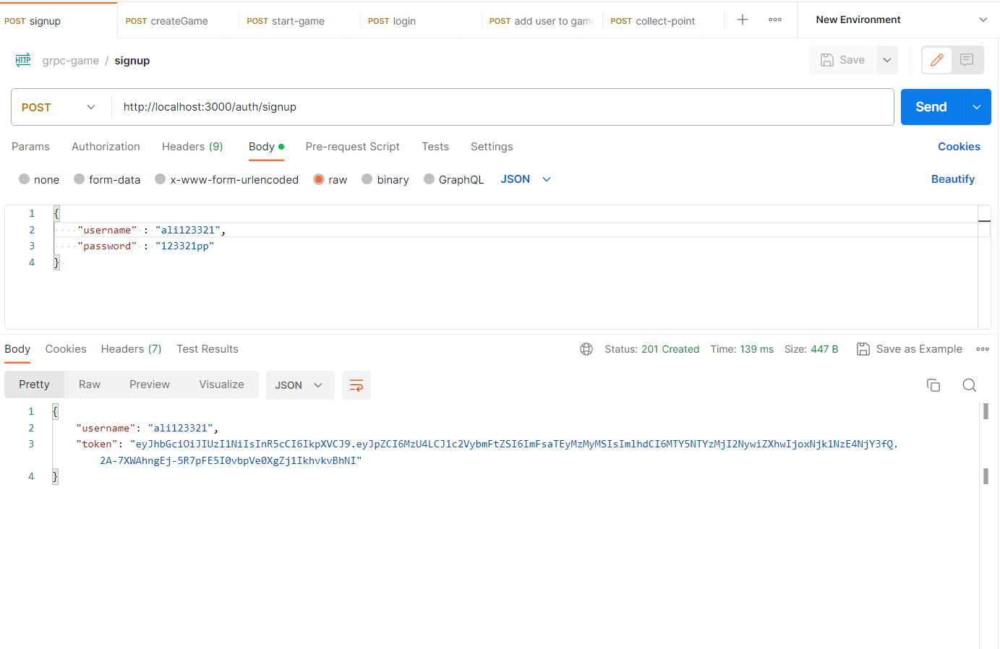
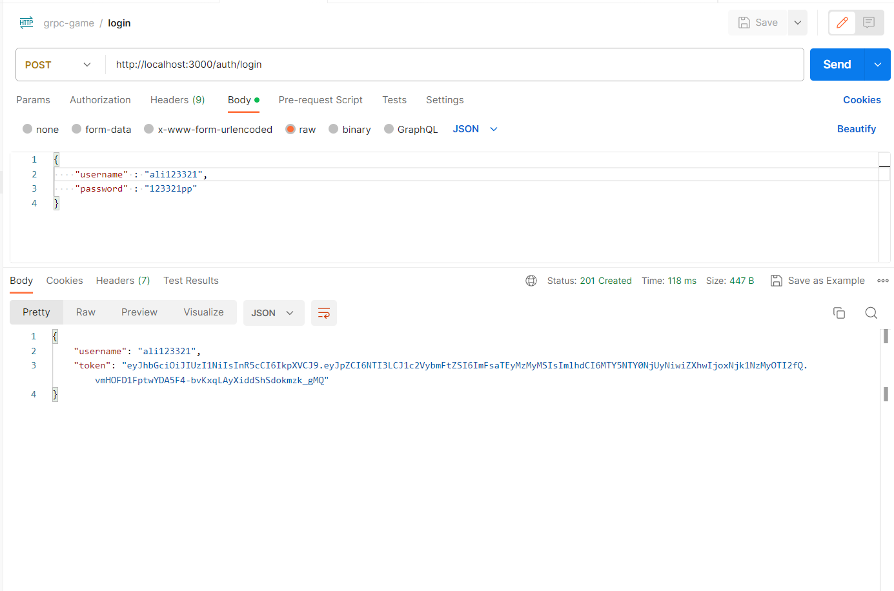
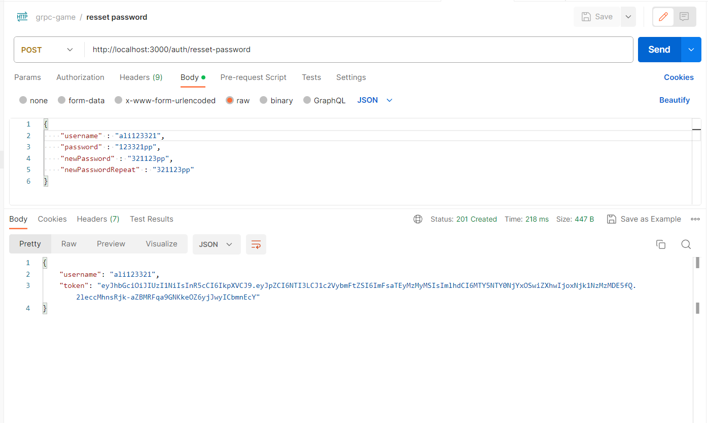
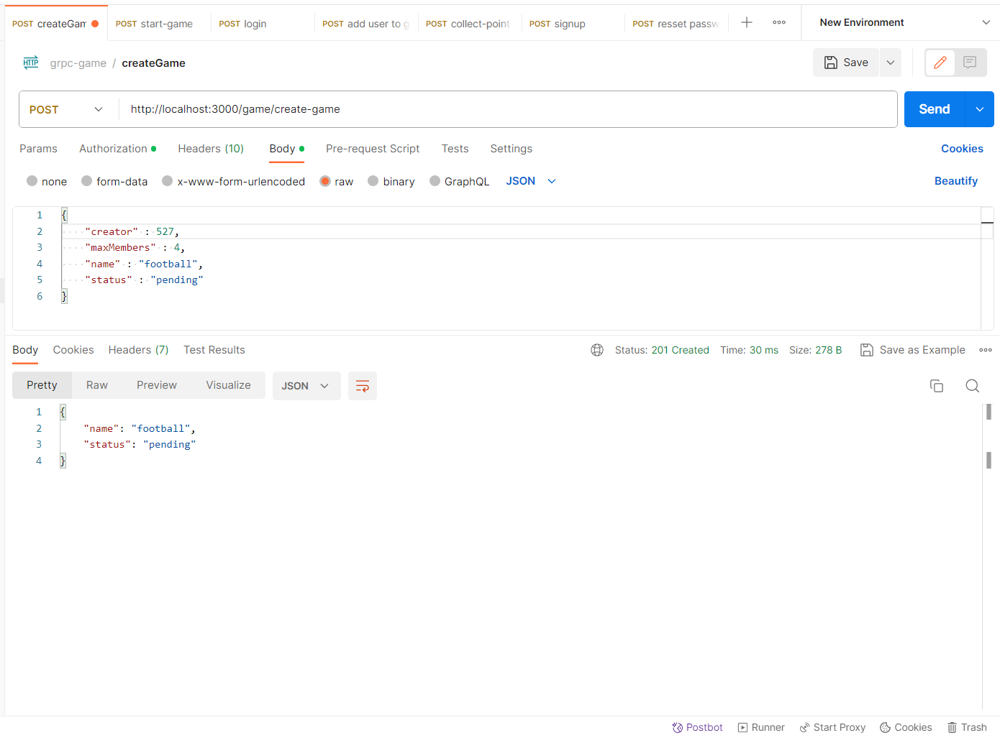
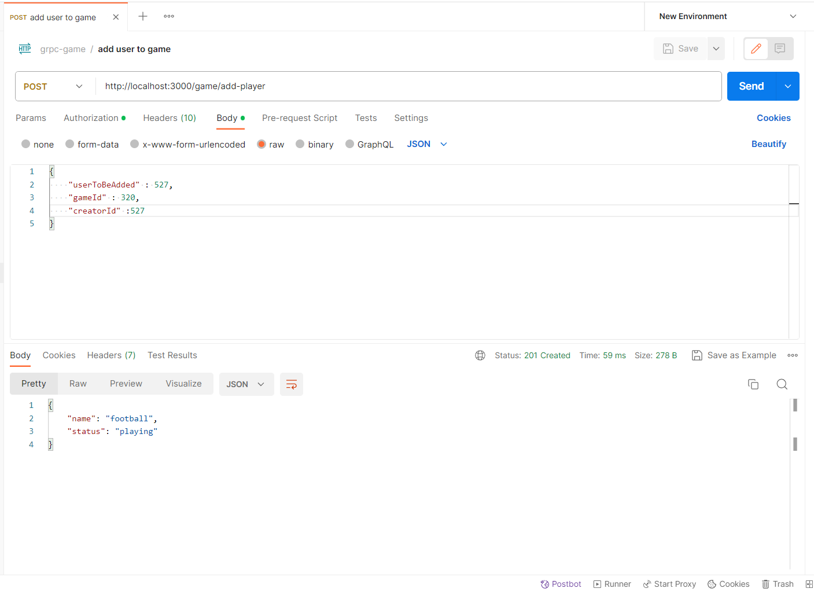
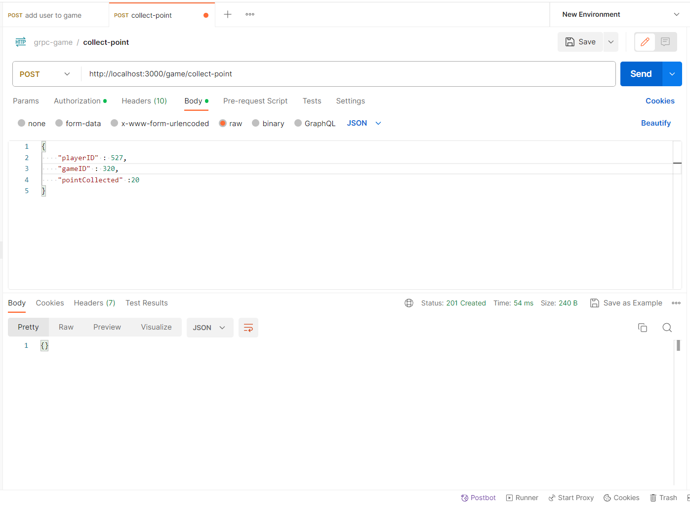
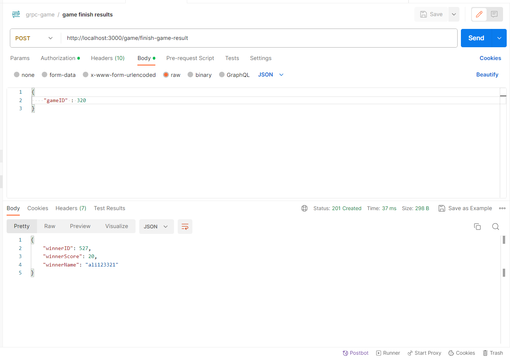
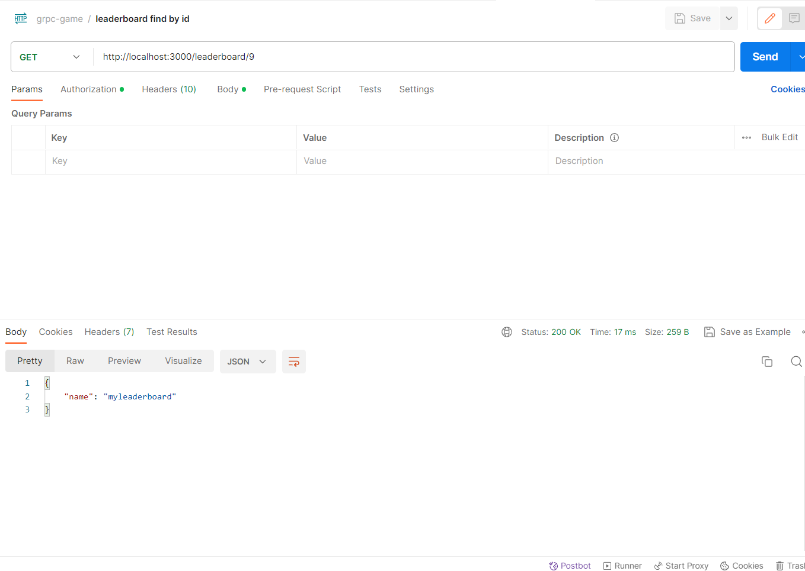
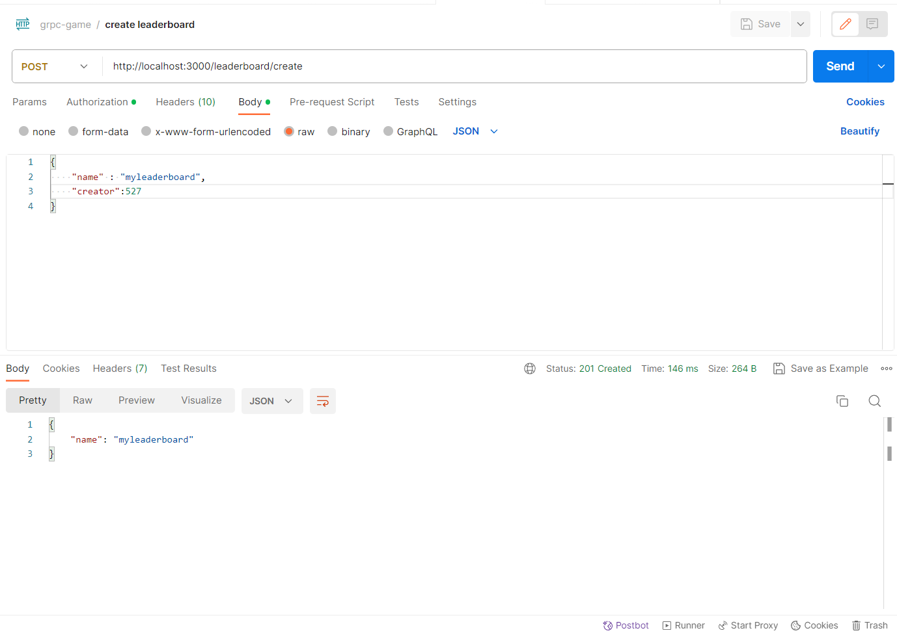

# Online Gaming with gRPC in TypeScript

Welcome to the Online Gaming project built with gRPC and TypeScript. This project demonstrates how to create a real-time game server and matchmaking service using the gRPC framework.

## Getting Started

### Prerequisites

Before you begin, ensure you have met the following requirements:

- Node.js: [Download and install Node.js](https://nodejs.org/).
- npm (Node Package Manager): npm comes bundled with Node.js, so no additional installation is required.

### Installation

Clone the repository:

```bash
git clone https://github.com/BaseMax/online-gaming-grpc-ts.git
cd online-gaming-grpc-ts
```

Install project dependencies:

```bash
npm install
```

### Building

Build the project by running:

```bash
npm run build
```

### Usage

To start the game server, run the following command:

```bash
npm run start:server
```

The game server will be running on `http://localhost:50051`.

### Starting the Matchmaking Service

To start the matchmaking service, run the following command:

```bash
npm run start:matchmaking
```

The matchmaking service will be running on `http://localhost:50052`.

### Creating a Game

You can create a new game by making gRPC requests to the matchmaking service. Refer to the API documentation or example code for details on how to use the matchmaking service to create and join games.

## Game Rules

Explain the rules and objectives of your online game. Include any special mechanics, scoring systems, or winning conditions. Use code snippets or diagrams to illustrate important game concepts. Here's an example section:

In our online game, players compete to achieve the highest score by collecting items and completing challenges. Here are some key rules:

- Players move using the arrow keys.
- Collect items to earn points.
- Complete challenges to unlock power-ups.
- The player with the highest score after a certain time wins the game.

## Criteria

- User can signup into system
- User can login into system with credentials
- User creates game after loging in
- User joins game after loging in
- User starts game
- User left game
- User plays game
- User sees ranking after game ends

- Game gets played with few members with default 500 points to get
- Game ends when all 500 points are gotten by users
- Game is played and each player could get 10 point by collecting goods in game
- Game lists all users with theire scores when ends
- Game saves score of player who left the game
- Game has a collect method for each user to be called
- Game has a start method for admin to run the game
- Game has a time period in which user admin sets

## HTTP

## GraphQL

| Request/             | Description                                  | Screenshot                                |
| -------------------- | -------------------------------------------- | ----------------------------------------- |
| `signup`             | signing up a new user.                       |        |
| `login`              | login a new user.                            |         |
| `resset_password`    | ressets password of user.                    |     |
| `create_game`        | creates a new game for a user .              |         |
| `add_player`         | adds new player (user) to one game.          |          |
| `collect_point`      | provides a collecting point for each player. |       |
| `game_finish`        | finishes a game and returns winner info.     |          |
| `find_leaderboard`   | finds a leaderboard based on id.             |    |
| `create_leaderboard` | creates a leaderboard.                       |  |

## Models

```typescript
interface User {
  id : number
  username : string
  password : string
  games : Game[]
  status : string (default: offline)

}
```

```typescript
interface Game {
  id : number
  name : string
  status : string (default : waiting)
  members : User[]
  memberNumber : number
  timetoplay : number
}
```

## Server PROTO GRPC

```proto

message User {
  string id = 1;
  string username = 2;
  string password = 3;
  Games games = 4;
}

message Games {
  repeated Game game = 1;
}

message Game {
  string id = 1;
  string name = 2;
  Members members = 3;
  string status = 4;
  int32 memberNumber = 5;
}

message Members {
  repeated User user = 1;
}

service AuthService {
  rpc SignUp(SignUpDto) return (SignUpType){}
  rpc Login(LoginDto) return (LoginType) {}
}

service UsersService {
  rpc CreateUser (CreateUserDto) returns (User) {}
  rpc FindAllUsers (Empty) returns (Users) {}
  rpc FindOneUser (FindOneUserDto) returns (User) {}
  rpc UpdateUser (UpdateUserDto) returns (User) {}
  rpc RemoveUser (FindOneUserDto) returns (User) {}
  rpc QueryUsers (stream PaginationDto) returns (stream Users) {}
}

service GameService {
  rpc CreateGame (CreateGameDto) returns (Game) {}
  rpc FindAllGames (Empty) returns (Games) {}
  rpc JoinGame(JoinGameDto) returns (Game) {}
  rpc FindOneGame (FindOneGameDto) returns (Game) {}
  rpc StartGame (StartGameDto) returns (Game) {}
  rpc AddUserToGame (AddUserToGameDto) returns (Game) {}
  rpc ListAvailableGames (stream PaginationDto) returns (stream Games) {}
  rpc CollectPoint (CollectPointDto) returns (CollectPointType){}
  rpc EndGame(EndGameDto) returns (EndGameType){}
  rpc ListMembersWithScores(ListMemberDto) returns (Users) {}
  rpc SaveMemberScore(MemberScoreDto) returns (Members) {}
}

```

## Architecture


## Examples

Provide usage examples and code snippets to help users understand how to interact with your gRPC APIs. Include both client and server-side examples. Here's an example section:

### Creating a Game (Client-Side)

```typescript
import { GameServiceClient } from './grpc/generated/game_grpc_pb';
import { CreateGameRequest } from './grpc/generated/game_pb';

const client = new GameServiceClient(
  'localhost:50051',
  grpc.credentials.createInsecure(),
);

const request = new CreateGameRequest();
request.setMapId(1);
request.setPlayersCount(4);

client.createGame(request, (error, response) => {
  if (!error) {
    console.log(`Game created with ID: ${response.getGameId()}`);
  } else {
    console.error('Error creating the game:', error);
  }
});
```

### Joining a Game (Server-Side)

```typescript
// Handle gRPC request to join a game
function joinGame(call, callback) {
  const gameId = call.request.getGameId();
  const playerId = generatePlayerId(); // Implement player ID generation
  const success = addPlayerToGame(gameId, playerId); // Implement game/player management logic

  if (success) {
    callback(null, { playerId });
  } else {
    callback(new Error('Failed to join the game'));
  }
}

// Register the joinGame function as a gRPC service method
server.addService(gameProto.GameService.service, { joinGame });
```

## Contributing

We welcome contributions from the community! If you'd like to contribute to this project, please follow these steps:

- Fork the repository.
- Create a new branch for your feature or bug fix.
- Make your changes and commit them with a clear and concise commit message.
- Push your changes to your fork.
- Create a pull request to the main repository's main branch.
- Please ensure your code follows best practices and includes appropriate tests.
